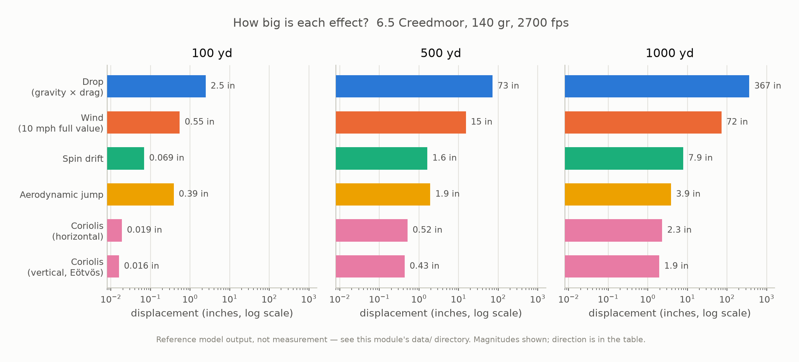
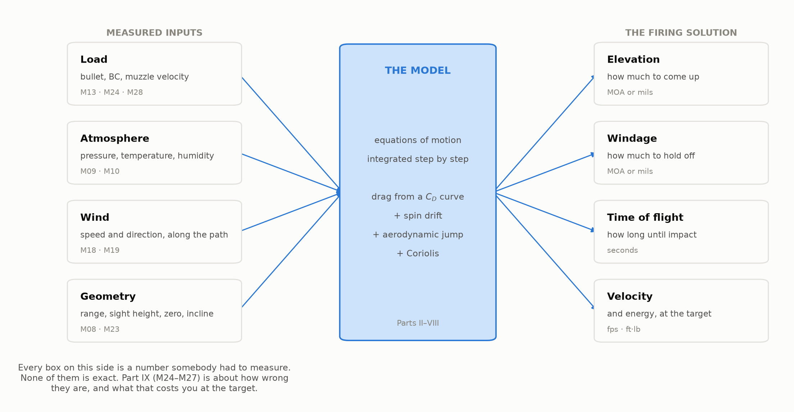
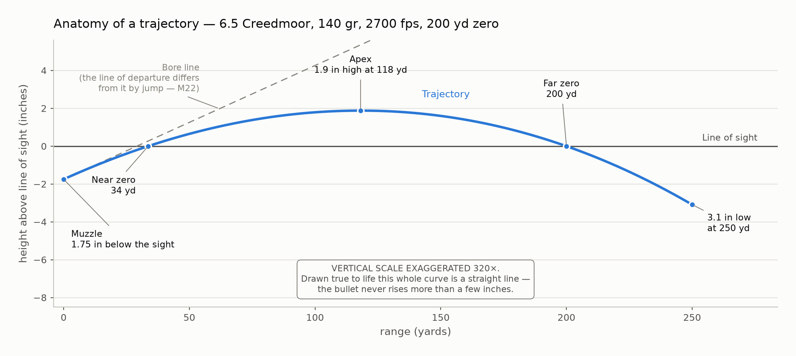

# Module 00 — What a Ballistic Solution Actually Is

> By the end of this module you can name every force acting on a bullet in
> flight, say roughly how big each one is at 100, 500, and 1000 yards, and
> explain what the remaining twenty-nine modules are going to do about them.

**Prerequisites:** None. This is the first module.
**You will build:** Nothing yet — deliberately. You have no tools.
**Estimated time:** ~1.5 hours

---

## 1. Why this matters

You are prone behind a 6.5 Creedmoor, 140 grain bullet, 2700 fps at the muzzle,
zeroed at 100 yards. The target is a 10-inch plate at 1000 yards. There is a
10 mph wind from your right.

If you hold dead centre and break a clean shot, the bullet lands roughly
**27 feet low and 6 feet left**. Not near the plate. Not on the berm behind it.
Twenty-seven feet is most of the way down a telephone pole.

That is not a marksmanship problem. Your rifle is fine, your position is fine,
and you did not flinch. The bullet went exactly where physics sent it. Getting
a hit means predicting all of that in advance and dialling it into the scope
before the shot — and the prediction has to be right to within a few inches at
the end of a flight that lasts a second and a half.

That prediction is a **ballistic solution**. Every app that produces one is
running a model. This course is about building that model yourself, so that
when it disagrees with reality — and it will — you can find out why instead of
buying a different app.

This module is the map. It does not derive anything. Its job is to show you the
whole board before the first piece moves: what the forces are, roughly how big
each one is, and which module deals with it.

## 2. Learning objectives

By the end of this module you will be able to:

- [ ] Trace the path from trigger press to impact and name each stage.
- [ ] List the physical effects a solver models, ranked by magnitude at a
      given range.
- [ ] State which effects matter at 300 yards and which only appear past 1000.
- [ ] Run the course code and regenerate a figure.
- [ ] Read the course's unit and coordinate conventions.

## 3. Concepts

### The three phases of a shot, and the one this course is about

A bullet's life has three phases, and they are three different fields of study.

| Phase | What happens | Covered here? |
|---|---|---|
| **Interior ballistics** | Primer to muzzle exit. Powder burns, pressure builds, the bullet accelerates up the barrel. | No |
| **Exterior ballistics** | Muzzle to target. The bullet is a free body in air. | **Yes — all of it** |
| **Terminal ballistics** | Impact onward. Penetration, expansion, energy transfer. | No |

This course is exterior ballistics only. Interior ballistics hands us one
number — **muzzle velocity** — and we take it as an input. Terminal ballistics
starts where we stop. That boundary is deliberate, and
[`docs/appendix-further-study.md`](../../docs/appendix-further-study.md)
explains what is on the other side of it and where to read about it.

### What a solver actually does

A ballistic solver is not a lookup table. It is a simulation. It takes the
bullet's state at the muzzle — position, velocity, direction — and steps it
forward through time in small increments, applying every force it knows about at
each step, until the bullet reaches the target.

Everything else is detail about which forces it knows and how well it models
them.

That framing matters because it tells you where errors come from. There are only
two places: **the inputs you measured** and **the physics you modelled**. A
solver that is wrong is wrong because you fed it a bad number or because its
model is missing something. Part IX of this course is about the first kind of
error, and Parts II through VIII are about the second.

### The forces, in order of size

Here is every effect this course models, largest first, for the running load at
1000 yards. Each gets a paragraph, and each gets a forward reference to the
module that does it properly. **Do not try to understand the mechanisms yet.**
The point right now is the ranking and the rough sizes.

**Gravity — 367 inches at 1000 yards.** The bullet begins falling the instant it
leaves the muzzle and never stops. It covers 1000 yards in about 1.5 seconds, and
over that time it falls about 31 feet. Gravity is the simplest thing in this
course and by far the largest. Modules 06 and 07 handle it.

You may have heard that a fired bullet and a dropped bullet hit the ground
together. In a vacuum that is exactly true. In air it is close but not true: a
bullet released from your hand would fall 37 feet in 1.5 seconds while ours falls
31, because once the trajectory angles downward, drag opposes the descent as well
as the forward motion. Module 07 makes that comparison precise.

**Drag — the reason everything else is as big as it is.** Air resistance is not
in the ranking as a separate row because it does not displace the bullet
sideways or downward. It does something worse: it slows the bullet down, which
increases the time of flight, which gives every other effect longer to act. Our
bullet leaves at 2700 fps and arrives at 1000 yards doing about 1440 fps. Without
drag it would arrive in 1.1 seconds instead of 1.5, and drop 20 feet instead of
31. Drag is the single most important thing in this course and Parts IV and V are
devoted to it.

**Wind — 72 inches for 10 mph at 1000 yards.** A crosswind pushes the bullet
sideways. The mechanism is not the one most people assume, and the amount is not
wind speed times time of flight — it is roughly a tenth of that. Modules 18 and
19 explain why, and why the wind near the muzzle matters far more than the wind
at the target.

**Spin drift — 7.9 inches at 1000 yards.** A bullet spun by the rifling drifts
sideways in the direction of the twist. Ours has a right-hand twist, so it drifts
right. This is a genuinely gyroscopic effect and it has no analogue in a
non-spinning projectile. Module 21.

**Aerodynamic jump — 3.9 inches at 1000 yards.** This is the counterintuitive
one. A *horizontal* crosswind produces a *vertical* shift in impact. Ours is a
right-hand twist with a wind from the right, so the bullet lands high. Module 22.

**Coriolis — 2.3 inches horizontal, 1.9 inches vertical at 1000 yards.** The
Earth rotates underneath the bullet during its flight. In the northern
hemisphere the horizontal component pushes right regardless of which way you
face; the vertical component depends on whether you are shooting east or west.
Module 23.

Notice the shape of that list. **The top of it is more than 150 times bigger
than the bottom.** At 1000 yards, if you get the drop right and ignore Coriolis
entirely, you are off by about three inches. If you get Coriolis right and are 5%
off on the drop, you are off by eighteen. Effort is worth spending in proportion
to size, and calibrating where that effort goes is one of the things this module
is for.

### Where these numbers came from — read this part

Every number above, and the whole table in this module's `data/` directory, is
**model output, not measurement**. Nothing was fired. There is no chronograph
and no target behind these figures.

They were produced by
[`data/generate_effect_magnitudes.py`](data/generate_effect_magnitudes.py), a
standalone reference implementation shipped with this module. It is committed,
you can read it, and it states its own assumptions in its header. It imports
nothing from `src/ballistics/`, and it is deliberately **not** the library you
are about to build.

That arrangement is on purpose, and it is worth being clear about why. Module 00
has a problem: it needs credible numbers on day one, before you have written a
single line of solver. There were three options. Cite a published table — but a
citation invented to look authoritative is worse than no citation. Ship
measurements — we have none. Or generate the numbers honestly and label them.

We took the third. And it sets up the payoff: **in Module 17 you will regenerate
that exact file with your own solver and diff it against this one.** That
comparison is worth something precisely because the two implementations are
independent — different code, written for different purposes. If they agree,
that is real evidence. If they disagree, Module 17 says so and investigates,
because a disagreement you explain is more instructive than an agreement you
arranged.

Three of the six columns are worth flagging harder still. Spin drift and
aerodynamic jump **cannot be derived from the model this course builds.** A
point-mass model treats the bullet as a dot, and a dot has no orientation, so it
cannot have a yaw angle or a gyroscopic response. Those two columns are
**empirical curve fits** imported from higher-fidelity work — Litz's
approximations, which depend in turn on Miller's stability rule, which is itself
a fit. They are labelled as such in the generator, in the CSV header, and in
[`data/README.md`](../../data/README.md).

This distinction runs through the entire course. **You should always be able to
tell which of your numbers are physics and which are curve fits.** Where the two
kinds sit side by side in a table, as they do here, the course says which is
which. That is the difference between this and a manual.

## 4. The magnitudes

No formulas in this module. The mathematics is arithmetic: ratios, percentages,
and orders of magnitude. Later modules earn the equations.

### Worked example — reading the table

The course carries **one load all the way through**, so that every module's
numbers can be checked against every other module's:

| | |
|---|---|
| Cartridge | 6.5 Creedmoor |
| Bullet | 140 gr Berger Hybrid Target |
| G7 ballistic coefficient | 0.315 lb/in² |
| Muzzle velocity | 2700 fps |
| Twist | 1:8 inches, right-hand |
| Sight height | 1.75 in above bore |
| Zero | 100 yards |

Under ICAO standard sea-level conditions, with a 10 mph full-value wind from
3 o'clock, at 40° N firing northeast, here is what
[`data/effect_magnitudes.csv`](data/effect_magnitudes.csv) says:

| Range | Time of flight | Drop | Come-up | Wind | Spin drift | Aero jump | Coriolis (h) |
|---|---|---|---|---|---|---|---|
| 100 yd | 0.11 s | 2.5 in | 0 | 0.5 in | 0.07 in | 0.4 in | 0.02 in |
| 500 yd | 0.64 s | 73 in | 53 in | 15 in | 1.6 in | 1.9 in | 0.5 in |
| 1000 yd | 1.52 s | 367 in | 326 in | 72 in | 7.9 in | 3.9 in | 2.3 in |
| 1200 yd | 1.97 s | 588 in | 540 in | 112 in | 13 in | 4.6 in | 3.5 in |

Four things are worth checking with your own arithmetic.

**Drop is not linear in range.** From 100 to 1000 yards the distance goes up by
a factor of 10, but drop goes up by a factor of **148**. Doubling from 500 to
1000 yards multiplies drop by 5, not 2. Gravity acts over *time*, and time of
flight grows faster than range does because the bullet is slowing down.

**Time of flight is not linear either.** The first 500 yards takes 0.64 s; the
second 500 takes 0.88 s. The bullet spends longer covering the back half of its
flight than the front half, which is why every effect accelerates with range.

**"Drop" and "come-up" are different numbers, and the difference is your zero.**
Drop is how far gravity pulled the bullet below the line the barrel was pointed
along: 367 inches at 1000 yards. Come-up is where the bullet is relative to your
line of *sight*: 326 inches. The 40-inch difference is the elevation your
100-yard zero already built into the rifle. The table carries both, in the
`drop_in` and `path_in` columns, because conflating them is a standard and
expensive mistake.

**Spin drift overtakes aerodynamic jump between 500 and 1000 yards.** At 500
yards jump is larger (1.9 vs 1.6 inches); at 1000 spin drift is twice jump (7.9
vs 3.9). They grow at different rates because they are different kinds of thing:
jump is an *angle* set in the first few feet of flight, so it grows linearly with
range, while spin drift accumulates with time of flight to nearly the second
power. Two effects of similar size at one distance can be nothing alike at
another.

### What "come-up" means at the scope

326 inches at 1000 yards is not how anyone dials it. Converted:

- **9.1 mils**, if your scope is in milliradians
- **31 MOA**, if it is in minutes of angle

Module 02 explains those units and why 31 MOA and 31 SMOA are not the same
correction. For now, note the practical consequence: 9 mils is a large fraction
of the elevation most scopes have available above their optical centre, which is
why long-range rifles are built with canted scope bases to buy some of it back.

## 5. The code you are not writing yet

This module adds **nothing** to `src/ballistics/`. That is deliberate. You have
no tools, and a tool you cannot yet evaluate is not worth having.

What you should do now is confirm the machinery runs.

```bash
uv sync
uv run pytest
```

Everything built so far should be green. Then regenerate a figure from this
module and confirm you get a PNG back:

```bash
uv run python modules/00-orientation/code/fig01_effect_magnitudes.py
```

It prints the path it wrote. Open it and compare it against Figure 0.1 below —
they should be identical, because **every figure in this course regenerates
byte-for-byte**. Any randomness is seeded, and `tools/build_figures.py --check`
enforces it. A figure that changed when nobody touched it would be noise in
every diff, and it would mean the course could not tell you when a number moved.

You can also regenerate the data table itself:

```bash
uv run python modules/00-orientation/data/generate_effect_magnitudes.py
```

That prints the published figures it is checking itself against. This is the
habit the whole course runs on: **numbers you can rerun**.

### Two conventions to read before Module 01

Two documents govern every line of code in this repository, and skimming them
now will save confusion later.

[`docs/units-and-conventions.md`](../../docs/units-and-conventions.md) —
the library is **SI on the inside** (metres, kilograms, seconds, radians) and
imperial only at the edges, because mixed-unit arithmetic is the most common
silent error in ballistics code. Every variable name carries its unit:
`range_m`, `velocity_mps`, `twist_in`, `drop_moa`. A bare `velocity` is a bug.
One deliberate exception: ballistic coefficient stays in lb/in², because every
published BC in the world is in those units.

[`docs/notation.md`](../../docs/notation.md) — one symbol table for the whole
course, and where the literature disagrees with itself, which convention we
follow. It matters more than it sounds: wind direction, twist hand, and
hemisphere are the three places sign errors hide, and all three are pinned down
there.

The coordinate frame, which every figure and every equation from here on
assumes: **origin at the muzzle, +x downrange along the line of sight, +y up,
+z to the shooter's right.**

## 6. Visualising it



**Figure 0.1** — Every effect this course models, as absolute displacement in
inches, at three ranges. 6.5 Creedmoor, 140 gr, 2700 fps, ICAO sea level, 10 mph
full-value crosswind, 40° N firing northeast. **The x-axis is logarithmic**, so
each gridline is ten times the one before it; because that makes bar *length*
unreliable as a measure, every bar is also labelled with its value. Magnitudes
only — directions are in the data table. Reference model output, not measurement.

**What to notice:** the log axis is not decoration, it is the only way this plot
works. On a linear axis, drop at 1000 yards is 367 inches and Coriolis is 2.3 —
the Coriolis bar would be less than one pixel wide, and four of the six effects
would be invisible. The ranking spans **more than four orders of magnitude**,
from 0.016 inches to 367. Also notice that the ranking is not fixed: at 100 yards
aerodynamic jump beats spin drift by a factor of five, and by 1000 yards spin
drift has overtaken it. An effect's rank depends on the range you asked about,
which is why "does spin drift matter?" has no answer until you say how far.



**Figure 0.2** — What a ballistic solver is, structurally. Four groups of
measured inputs go in, one model runs, four numbers come out. The module
references on each box are where that piece is built.

**What to notice:** the left column. Every one of those boxes is a number a
human being had to measure with an instrument — a chronograph, a weather meter,
a rangefinder, a wind meter, a bullet manufacturer's published BC. **None of them
is exact**, and the solution can be no better than the worst of them. This is
why Part IX is a quarter of the course rather than an appendix: knowing that your
muzzle velocity is 2700 fps ± 15 is a completely different situation from
believing it is 2700. Notice also what is *not* on the left: nothing about your
rifle's mechanical precision or your ability to hold it. The model tells you
where the bullet goes on average. How tightly it groups around that average is
Module 25, and whether you hit is Module 27.



**Figure 0.3** — The parts of a trajectory, named. Same load, but drawn at a
**200-yard zero** rather than the course's 100-yard zero, because at a 100-yard
zero both crossings are crammed into the left edge and the geometry is
unreadable. **The vertical scale is exaggerated 320×** — the figure computes that
factor from its own rendered axes rather than asserting it, so it cannot drift.
The bore line and the line of departure are drawn as one line; they genuinely
differ, by the jump the rifle imparts at exit, but that is a few tenths of an
MOA and Module 22 is the place to quantify it rather than sketch it.

**What to notice:** the bullet crosses the line of sight **twice**, and spends
the middle of its flight *above* it. That surprises people who picture the sight
line as a ceiling. The barrel points upward relative to your line of sight — it
has to, or the bullet could never be on target at any distance — so the bullet
climbs, crosses at the near zero around 34 yards, peaks 1.9 inches high at 118
yards, comes back down through the far zero at 200, and falls away increasingly
fast after that.

And then the exaggeration, which is the real lesson. That graceful arc is a lie
of the y-axis. Stretch the vertical by 320× and you get a rainbow; draw it true
to scale and the entire curve is visually a straight line, because the bullet
rises less than two inches while travelling 7200. **Bullets do not arc over
things at these distances.** Every trajectory diagram you have ever seen was
exaggerated, most of them did not say so, and the mental picture they leave
behind is wrong.

## 7. Limits and sanity checks

**Every number in this module is for one load, in one atmosphere, on one
heading.** Change any of them and the table changes. A .308 with a 175 gr bullet
at 2600 fps — the course's contrast load — needs about 30% more elevation at 1000
yards and over 50% more wind hold, because its lower BC bleeds velocity faster.
At 5000 feet of elevation the thinner air cuts the drop noticeably. Fire due
north instead of northeast and the vertical Coriolis component vanishes while the
horizontal one does not.

**Ranked lists are range-dependent.** "Spin drift is bigger than aerodynamic
jump" is true at 1000 yards and false at 100. Any statement of the form "effect X
matters" is incomplete without a distance and a target size.

**The two empirical columns have limited validity.** Litz's spin drift and
aerodynamic jump fits were built for conventional long-range match bullets at
supersonic speed. They say nothing reliable about a subsonic bullet, a very short
or very long projectile, or a marginally stable one. Miller's stability rule
underneath them is fitted to jacketed lead-core bullets and does not know what a
plastic tip or a monolithic copper bullet is. Modules 20 through 22 state these
boundaries precisely; for now, know that they exist.

**This is a point-mass model, and it has a hard ceiling.** It treats the bullet
as a dot with a drag coefficient. It cannot represent the bullet's orientation,
which is why spin drift and jump had to be imported rather than derived. It will
also degrade through the transonic region, roughly Mach 1.2 down to 0.8, where
drag changes fast and the bullet is most easily disturbed. Our load is at Mach
1.29 at 1000 yards and crosses Mach 1.2 at around 1100 — so the **last two rows
of the table are entering the transonic band**, and are the least trustworthy
numbers in it. The .308 contrast load gets there several hundred yards sooner.
Module 10 explains what happens in that region and why it is hard to model.

**What would falsify all of this:** shooting it. Every number here is a
prediction. Module 28 is about what to do when your rifle disagrees with your
solver, and the answer is emphatically not "assume the rifle is wrong."

## 8. Field takeaways

- **Effort follows magnitude.** At 1000 yards, a 5% error in your drop
  calculation costs 18 inches; ignoring Coriolis entirely costs 3. Get velocity,
  BC, and range right before you spend a minute on the small effects.
- **Wind is the effect you cannot look up.** Drop is repeatable and can be
  recorded once in a DOPE book. Wind changes between shots and has to be read in
  the field, every time. It is the largest source of miss at long range for
  exactly that reason.
- **Know what your zero already bought you.** Your rifle's drop and your dial
  chart are different numbers. Confusing them is a 40-inch error at 1000 yards
  with this load.
- **Effects that are equal at one distance are not equal at another.** Anything
  set as an angle at the muzzle grows linearly; anything accumulating over flight
  time grows faster. Never extrapolate a correction linearly from a shorter range.
- **A solver's output is a prediction with error bars, even when it prints four
  decimal places.** The decimals come from the arithmetic, not from the quality
  of your inputs.

## 9. Exercises

Five estimation problems. They need arithmetic and a sense of scale, not
formulas — the point is to build intuition that later modules will sharpen, and
in two cases deliberately correct.

[Exercises](exercises/exercises.md) · [Solutions](exercises/solutions.md)

## 10. Key numbers

No equations yet. This is the card worth keeping — the running load, at ICAO sea
level, 10 mph full-value wind, 40° N firing northeast.

| Range | ToF | Come-up | | Wind | Spin drift | Aero jump | Coriolis |
|---|---|---|---|---|---|---|---|
| 100 yd | 0.11 s | 0 | | 0.5 in | 0.07 in | 0.4 in | 0.02 in |
| 300 yd | 0.36 s | 13 in (1.2 mil) | | 5.2 in | 0.6 in | 1.2 in | 0.2 in |
| 500 yd | 0.64 s | 53 in (2.9 mil) | | 15 in | 1.6 in | 1.9 in | 0.5 in |
| 800 yd | 1.13 s | 181 in (6.3 mil) | | 43 in | 4.6 in | 3.1 in | 1.4 in |
| 1000 yd | 1.52 s | 326 in (9.1 mil) | | 72 in | 7.9 in | 3.9 in | 2.3 in |
| 1200 yd | 1.97 s | 540 in (12.5 mil) | | 112 in | 13 in | 4.6 in | 3.5 in |

Muzzle velocity 2700 fps; **1440 fps remaining at 1000 yards**. Reference model
output, not measurement.

Rules of thumb worth carrying:

| | |
|---|---|
| Drop vs range | grows much faster than linearly — 10× the range, ~150× the drop |
| Wind deflection | roughly a tenth of "wind speed × time of flight" |
| Anything set as a muzzle angle | grows linearly with range (aerodynamic jump) |
| Anything accumulating in flight | grows with time of flight, faster than linearly (spin drift) |
| Northern hemisphere Coriolis | always pushes right, whichever way you face |

## 11. References

See [`docs/references.md`](../../docs/references.md) for full citations.

- **McCoy, *Modern Exterior Ballistics*** — the technical reference this course
  defers to, and where the effects surveyed here are derived properly.
- **Litz, *Applied Ballistics for Long-Range Shooting*** — source of the spin
  drift and aerodynamic jump approximations used in this module's data.
- **Miller, "A New Rule for Estimating Rifling Twist" (2005)** — the gyroscopic
  stability estimate those two approximations depend on.
- **Ballistic Research Laboratory** — origin of the G7 standard drag function
  used by this module's generator. Module 13 ships the authoritative tables.
- [`docs/appendix-further-study.md`](../../docs/appendix-further-study.md) —
  what 4DOF and 6DOF models add, and why this course stops where it does.

## 12. What's next

You now know the sizes. You cannot yet compute a single one of them.

The gap is that you have no way to write down what you know without ambiguity.
"2700 fps", "0.315 lb/in²", "1:8 twist", "31 MOA" — four numbers in four unit
systems, two of which are commonly confused with something else. Before any
physics, the course needs one internally consistent way to state a quantity and
convert it, and a way to tell when an equation is wrong just by looking at its
units.

**Module 01 — Units, Measurement, and Dimensional Analysis** builds that, and it
is where `src/ballistics/` gets its first real code.
