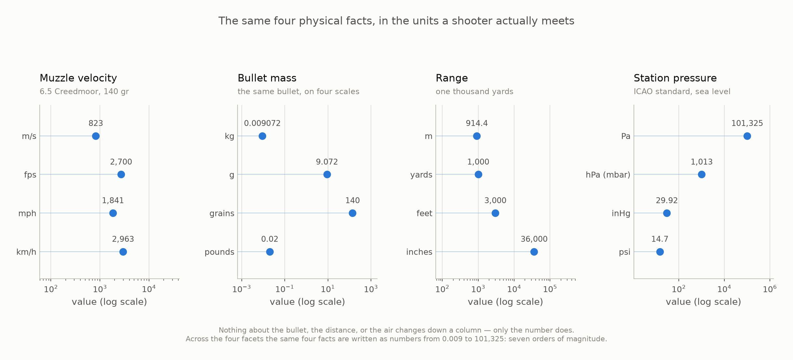
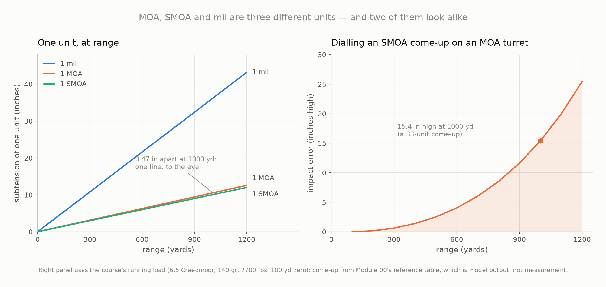
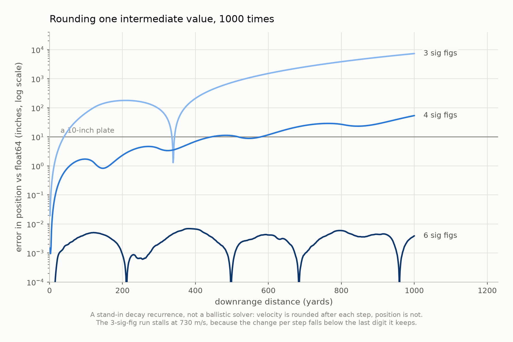

# Module 01 — Units, Measurement, and Dimensional Analysis

> By the end of this module you will stop making unit errors, and you will be
> able to check any equation in this course — or any ballistics forum post —
> for dimensional sense before you trust it.

**Prerequisites:** Module 00.
**You will build:** `ballistics/constants.py` and `ballistics/units.py` — the
first real code in the library, and the only place conversions are allowed to
live.
**Estimated time:** ~2 hours

---

## 1. Why this matters

Here is a number you can find on any ammunition box: a 6.5 Creedmoor pushing a
140 grain bullet at 2700 fps carries **2267 foot-pounds** of muzzle energy.

Work it out yourself. Kinetic energy is $\tfrac{1}{2}mv^2$, so:

$$\tfrac{1}{2} \times 140 \times 2700^2 = 510{,}300{,}000$$

Five hundred and ten million of *something*. The formula is right. The
arithmetic is right. The answer is off by a factor of about 225,000, because
grains are not kilograms and feet per second are not metres per second, and the
equation does not know that.

That failure is loud enough to catch. Divide by 7000 to turn grains into pounds
and you get 72,900 — still thirty-two times too big, because in this system a
pound is a unit of *weight* and not of mass, and the missing factor is $g$.
Divide by 32.174 as well and you land on 2265.8 ft·lb, which is the answer.
Section 4 does that properly.

The dangerous errors are the quiet ones. Suppose your solver takes a station
pressure in inches of
mercury and you hand it 1013 because that is what the app showed. It will not
crash. It will produce a trajectory, and a range card, and a number of clicks,
and every one of them will look exactly like a right answer.

**Unlike a crash, a wrong-by-a-factor answer looks plausible.** This module is
about the two habits that catch it: converting through one internally
consistent system, and checking an equation's dimensions before believing it.
Both are cheap. Both are the difference between a solver you can debug and one
you can only trust.

## 2. Learning objectives

By the end of this module you will be able to:

- [ ] Convert among grains, grams, fps, m/s, yards, metres, inches, inHg, hPa,
      °F and K, and say which of those conversions are exact and which are not.
- [ ] Test an equation for dimensional homogeneity and reject a wrong one
      without knowing any of the physics in it.
- [ ] Distinguish accuracy from precision, and absolute from relative error.
- [ ] Apply significant-figure discipline, and explain the point at which it
      stops mattering and the point at which it starts destroying answers.
- [ ] Explain why this library is SI internally despite an imperial audience,
      and why MOA and SMOA are two different units.

## 3. Concepts

### A conversion factor is a way of multiplying by one

One yard is 0.9144 metres. That is not an approximation and not a measurement:
it is a *definition*, agreed in 1959. Written as a fraction it says something
useful:

$$\frac{0.9144\ \text{m}}{1\ \text{yd}} = 1$$

The numerator and the denominator are the same length, so the fraction is
dimensionless and equal to one. Multiplying by it changes nothing physical. It
only changes the label:

$$1000\ \text{yd} \times \frac{0.9144\ \text{m}}{1\ \text{yd}} = 914.4\ \text{m}$$

The yards cancel the way $x$ cancels. That is the entire mechanism, and it is
worth taking literally, because it tells you immediately whether you should
multiply or divide: **write the factor so the unit you are getting rid of
cancels.** If your units do not cancel, you have the factor upside down, and
you will find out now rather than at 900 yards.

### Three kinds of number live in `constants.py`

Not every conversion factor is the same kind of fact, and the difference
decides what a test is allowed to assert.

**Exact by definition.** Somebody wrote it down. The 1959 international yard
and pound agreement fixes

$$1\ \text{yd} \equiv 0.9144\ \text{m}, \qquad 1\ \text{lb} \equiv 0.45359237\ \text{kg}$$

and everything imperial in this course descends from those two lines. An inch
is exactly 25.4 mm because a yard is exactly 0.9144 m. A grain is exactly
1/7000 of a pound, so

$$1\ \text{gr} = \frac{0.45359237}{7000}\ \text{kg} = 6.479891\times10^{-5}\ \text{kg} = 64.79891\ \text{mg}$$

**exactly**. Not 64.8. The rounded value is wrong in the fifth significant
figure, and we will see it move a published number in §4.

Standard gravity belongs in this group too, which surprises people:

$$g \equiv 9.80665\ \text{m/s}^2$$

is a *defined* value, not a measurement of gravity anywhere. Real local gravity
runs from about 9.780 at the equator to 9.832 at the poles — a 0.5% spread that
Module 26 decides whether to carry.

**Conventional, resting on a measurement.** Exactly one factor in this library
is in this group. An inch of mercury is defined from a *conventional* mercury
density, and that density was measured:

$$1\ \text{inHg (at 32 °F)} = 3386.389\ \text{Pa}$$

Seven figures is all there is. You cannot demand more precision from it, and a
test that asserts bit-exact round-tripping through it is asserting something
false.

**Derived.** Reciprocals and products of the above. These get written as
expressions, not as decimal literals, so they cannot drift from their
definitions.

### Exact in decimal is not exact in binary

Here is a fact that catches everyone once, and this is a good place to meet it.

Three feet is a yard. Exactly. In float64:

```python
>>> 3 * 0.3048
0.9144000000000001
>>> 0.9144
0.9144
```

Those are two different doubles. Nothing is wrong with either constant — each
is the nearest double to its exact decimal value — but 0.3048 and 0.9144 are
both *inexact in binary*, because a finite decimal fraction is generally an
infinite binary one, and multiplying them rounds again.

This has a direct consequence for how `constants.py` is written. **Every factor
with an exact decimal form is written as that decimal literal, never derived by
arithmetic from another one.** Python parses a literal to the nearest double;
arithmetic compounds the rounding twice. Writing `M_PER_FOOT = 12 * M_PER_INCH`
gives 0.30479999999999996 — a full unit in the last place low before anything
is even converted — and `fps_to_mps(2700)` then returns 822.9599999999999
instead of 822.96.

Neither answer will ever move a bullet: one unit in the last place at 1000
yards is under a nanometre, and the bullet is 6.7 millimetres across. But
noticing the difference is the skill this module is teaching, and §7 draws the
line between the errors that matter and the ones that do not.

### Dimensional analysis: the check that needs no physics

A **dimension** is what a quantity *is*, stripped of the unit it is written in.
A length is a length whether you write it in yards or in metres. Mechanics
needs three:

| Dimension | Written | Examples |
|---|---|---|
| mass | $[\mathrm{M}]$ | grains, kilograms |
| length | $[\mathrm{L}]$ | inches, metres |
| time | $[\mathrm{T}]$ | seconds |

The square brackets matter and are not decoration. Bare $M$, $L$ and $T$ are
already taken in [`docs/notation.md`](../../docs/notation.md) — Mach number,
lapse rate, and temperature — so $[\mathrm{M}]$ and $M$ are different things,
and the notation has to say which is meant. (From Module 09 there is a fourth,
$[\Theta]$ for temperature; mechanics does not need it.)

Every mechanical quantity is a product of powers of the three:

| Quantity | Dimensions | Because |
|---|---|---|
| velocity | $[\mathrm{L}][\mathrm{T}]^{-1}$ | distance over time |
| acceleration | $[\mathrm{L}][\mathrm{T}]^{-2}$ | velocity over time |
| force | $[\mathrm{M}][\mathrm{L}][\mathrm{T}]^{-2}$ | $F = ma$ |
| energy | $[\mathrm{M}][\mathrm{L}]^2[\mathrm{T}]^{-2}$ | force times distance |
| density | $[\mathrm{M}][\mathrm{L}]^{-3}$ | mass over volume |
| pressure | $[\mathrm{M}][\mathrm{L}]^{-1}[\mathrm{T}]^{-2}$ | force over area |
| Mach number | $[1]$ | a speed over a speed |

And now the rule that does the work:

> **Dimensional homogeneity.** Every term in a physically meaningful equation
> has the same dimensions. You cannot add a length to a time, and an equation
> that claims to is wrong.

The rule is one-directional and it is important to be honest about that. A
dimensionally consistent equation can still be wrong — it can have a factor of
2 out of place, or the wrong sign, or the wrong physics entirely, and
dimensions will not notice. But a dimensionally *inconsistent* equation is
wrong with certainty, and you can establish that in fifteen seconds without
knowing what any of the symbols mean. For a forum post claiming a new wind
formula, that is often all the checking it needs.

### Accuracy, precision, and two ways to state an error

These four words get used interchangeably in conversation and mean four
different things here.

**Accuracy** is how close you are to the truth. **Precision** is how tightly
your measurements cluster, whether or not that cluster is anywhere near the
truth. A chronograph reading 2850 fps every time on a 2700 fps load is
*precise* and *inaccurate*, and the second property is invisible from the data
alone — you cannot detect a bias by looking harder at the numbers it produced.
Module 25 makes this quantitative for groups on paper; Module 24 measures it
for instruments.

**Absolute error** carries the units of the thing: your muzzle velocity is
2700 ± 15 fps. **Relative error** is dimensionless, usually a percentage:
15/2700 = 0.56%. Which one to use depends on the question. Absolute error tells
you how far off the answer is; relative error tells you how much of the answer
is error, and it is the one that propagates cleanly through multiplication.

### How errors grow

Two rules cover almost everything this course needs, and the second is the one
that surprises people.

**Through addition, absolute errors add** (in the worst case):

$$u(a + b) \le u(a) + u(b)$$

**Through multiplication and powers, relative errors add**, and a power
multiplies its exponent in:

$$\frac{u(ab)}{ab} \le \frac{u(a)}{a} + \frac{u(b)}{b}, \qquad \frac{u(x^n)}{x^n} = |n|\,\frac{u(x)}{x}$$

That second one has teeth. Kinetic energy goes as $v^2$, so **a 0.56% error in
muzzle velocity is a 1.11% error in muzzle energy** — the uncertainty doubles
on the way through. Anything that squares a measured quantity doubles its
relative error, and drag squares velocity.

These are worst-case rules, which assume the errors conspire. Module 26
replaces them with the proper statistical treatment, where independent errors
add in quadrature and the result is smaller. Until then, worst case is the
honest default: it never flatters your solver.

### Significant figures, and where they stop being a virtue

The significant figures of a number are the digits that carry information.
Writing 2700 fps when your chronograph is good to ±15 claims a precision you do
not have; writing 2265.8013 ft-lb of muzzle energy from that velocity claims
eight.

The traditional rules are worth stating once:

- **Multiplication and division:** the result gets the fewest significant
  figures of any input.
- **Addition and subtraction:** the result gets the fewest *decimal places*.
- **Round once, at the end.** Never round an intermediate.

That last rule is the one this module cares about, and Figure 1.3 shows what
happens when you break it. But there is a second half to the story that
textbooks tend to leave out: **inside a computation, significant figures are
the wrong tool entirely.** Carry every digit float64 gives you — all sixteen —
and apply the discipline only when you print the answer. The digits cost
nothing, and the moment you start rounding intermediates you are injecting an
error that compounds.

## 4. The mathematics

### Dimensional homogeneity, worked

The drag equation is the most important formula in this course and Module 11
derives it properly. You have not seen that derivation. Check it anyway:

$$F_D = \tfrac{1}{2}\,\rho\, v^2\, C_D\, A$$

Take the right-hand side apart. Air density $\rho$ is $[\mathrm{M}][\mathrm{L}]^{-3}$.
Velocity squared is $\left([\mathrm{L}][\mathrm{T}]^{-1}\right)^2 = [\mathrm{L}]^2[\mathrm{T}]^{-2}$.
Reference area $A$ is $[\mathrm{L}]^2$. The $\tfrac{1}{2}$ is a pure number and
carries no dimensions. So, writing $[C_D]$ for the unknown:

$$[F_D] = [\mathrm{M}][\mathrm{L}]^{-3} \cdot [\mathrm{L}]^2[\mathrm{T}]^{-2} \cdot [C_D] \cdot [\mathrm{L}]^2$$

Collect the length exponents: $-3 + 2 + 2 = 1$.

$$[F_D] = [\mathrm{M}][\mathrm{L}][\mathrm{T}]^{-2} \cdot [C_D]$$

The left-hand side is a force, which is $[\mathrm{M}][\mathrm{L}][\mathrm{T}]^{-2}$.
For the equation to be homogeneous:

$$[C_D] = [1]$$

**The drag coefficient must be dimensionless.** We derived that from nothing
but bookkeeping — no aerodynamics, no wind tunnel, no idea yet what $C_D$
physically represents. And it is a genuinely useful result: it means $C_D$ is
the same number in every unit system, and it means a $C_D$ quoted with units
attached is a $C_D$ someone has misunderstood.

Note what dimensional analysis could *not* tell us: that the factor is
$\tfrac{1}{2}$ and not 2 or $\pi$, or that $C_D$ depends on Mach number rather
than on speed. Dimensions constrain the form of an equation. They do not
determine it.

### Boxed result: MOA and SMOA differ by exactly $\pi/3$

Three angular units appear on scope turrets, and two of them are routinely
confused because their names are nearly the same.

A **true MOA** is a minute of arc, one sixtieth of a degree:

$$1\ \text{MOA} = \frac{1}{60} \times \frac{\pi}{180}\ \text{rad} = \frac{\pi}{10800} = 2.908882\times10^{-4}\ \text{rad}$$

An **SMOA** — "shooter's MOA", also sold as IPHY, "inches per hundred yards" —
is defined not as an angle but as a *subtension ratio*: one inch at one hundred
yards. One hundred yards is 3600 inches, so

$$1\ \text{SMOA} = \frac{1\ \text{in}}{3600\ \text{in}} = \frac{1}{3600} = 2.777778\times10^{-4}$$

Divide them, and the units of length cancel to leave a pure number:

$$\boxed{\ \frac{\text{MOA}}{\text{SMOA}} = \frac{\pi/10800}{1/3600} = \frac{3600\pi}{10800} = \frac{\pi}{3} = 1.0471975512\ }$$

Exactly $\pi/3$. That is where the familiar **1.047 inches at 100 yards** comes
from: it is $\pi/3$ inches, and it is not a coincidence or a rounding, it is
the ratio of a circle's minute to a draughtsman's convenience.

The consequences, both directions, because they are stated wrongly about as
often as they are stated:

- An SMOA is **4.51% smaller** than a true MOA.
- A true MOA is **4.72% larger** than an SMOA.

Those are different percentages of different denominators and they describe the
same fact. And a note on strictness: SMOA defined as a *ratio* is a tangent
rather than an angle. The corresponding angle is $\arctan(1/3600)$, which
differs in the eleventh significant figure. We take the ratio as the
definition, because that is what the shooting world means and because it makes
$\pi/3$ come out exactly.

A **mil** in this course is always a true milliradian, exactly 0.001 rad. It is
not any of the 6000-, 6300- or 6400-mil artillery circles. Scope makers agree
with us; artillery manuals often do not.

### Worked example — where the reloading manual's magic number comes from

Every reloading manual prints this formula for muzzle energy, usually with no
explanation:

$$E_{\text{ft·lb}} = \frac{m_{\text{gr}} \times v_{\text{fps}}^2}{450240}$$

Where does 450240 come from? Derive it, and then check it — this is the
module's promise in one example.

**Step 1: the honest SI path.** Convert first, then compute.

$$m = 140\ \text{gr} \times 6.479891\times10^{-5}\ \frac{\text{kg}}{\text{gr}} = 9.0718474\times10^{-3}\ \text{kg}$$

$$v = 2700\ \text{fps} \times 0.3048\ \frac{\text{m/s}}{\text{fps}} = 822.96\ \text{m/s}$$

$$E = \tfrac{1}{2}mv^2 = \tfrac{1}{2} \times 9.0718474\times10^{-3} \times 822.96^2 = \tfrac{1}{2} \times 9.0718474\times10^{-3} \times 677263.16$$

$$E = 3072.014\ \text{J}$$

Convert to foot-pounds, dividing by the exact factor 1.3558179483314:

$$E = \frac{3072.014}{1.3558179483314} = 2265.80\ \text{ft·lb}$$

**Step 2: derive the constant.** Now do it the manual's way, keeping the units
visible. We want $\tfrac{1}{2}mv^2$ with $m$ in grains and $v$ in fps, coming
out in foot-pounds. In the imperial gravitational system, mass in slugs is
weight in pounds divided by $g$ in ft/s², and there are 7000 grains to the
pound:

$$m_{\text{slug}} = \frac{m_{\text{gr}}}{7000 \times g_{\text{ft/s}^2}}$$

$$E_{\text{ft·lb}} = \tfrac{1}{2} \times \frac{m_{\text{gr}}}{7000\, g} \times v_{\text{fps}}^2 = \frac{m_{\text{gr}}\, v_{\text{fps}}^2}{2 \times 7000 \times g}$$

So the divisor is $2 \times 7000 \times g$, with $g$ in ft/s². Standard gravity
is 9.80665 m/s², which is

$$g = \frac{9.80665}{0.3048} = 32.174049\ \text{ft/s}^2$$

giving

$$2 \times 7000 \times 32.174049 = 450436.7$$

**Not 450240.** The published constant is 197 low. Work backwards from it:

$$g_{\text{implied}} = \frac{450240}{14000} = 32.16\ \text{ft/s}^2$$

The manual's constant encodes $g = 32.16$, an older and slightly stale value of
standard gravity.

**Step 3: what it costs.**

| Path | Muzzle energy |
|---|---|
| SI, converted honestly | **2265.80 ft·lb** |
| Manual, $\div\,450240$ | **2266.79 ft·lb** |
| Difference | 0.99 ft·lb, or **0.044%** high |

Four hundredths of a percent. Nobody will ever miss because of it, and that is
worth saying as plainly as the discrepancy itself — the point of this exercise
is not that the manual is dangerous. The point is that **you can now tell.** You
opened a constant somebody handed you, found the physics inside it, and put a
number on how much it is off by. That is the whole skill, and the next time the
constant is wrong by 4% instead of 0.04% you will find that too.

### The running load, converted once

Every module carries this load. Here it is in both systems, and these are the
numbers the rest of the course computes with.

| Quantity | As quoted | In SI |
|---|---|---|
| Bullet mass | 140 gr | 9.0718474 × 10⁻³ kg |
| Muzzle velocity | 2700 fps | 822.96 m/s |
| Calibre | 0.264 in | 6.706 × 10⁻³ m |
| Sight height | 1.75 in | 4.4450 × 10⁻² m |
| Twist | 1:8 in | 0.2032 m/turn |
| Range | 1000 yd | 914.4 m |
| Station pressure | 29.9213 inHg | 101325 Pa |
| Temperature | 59 °F | 288.15 K |
| Wind | 10 mph | 4.4704 m/s |
| G7 BC | 0.315 lb/in² | 0.315 lb/in² — *stays imperial, on purpose* |

That last row is the course's one deliberate inconsistency. Every published
ballistic coefficient in the world is in lb/in², and converting them would
produce numbers matching no bullet box and no reference table anywhere. So BC
stays imperial and the variable name says so: `bc_lbin2`. Module 13 explains
what the units actually mean.

## 5. Building the code

This module adds two files, and they are the foundation every later module
imports.

### `constants.py` is organised by provenance, not by quantity

The obvious layout groups by physical quantity: all the lengths together, all
the masses together. This file groups by *where the number came from* instead —
exact, conventional, derived — because that is the distinction that changes
what you are allowed to do with it:

```python
# --- Exact by definition: length -------------------------------------------
M_PER_INCH = 0.0254
M_PER_FOOT = 0.3048       # = 12 in
M_PER_YARD = 0.9144       # = 36 in

# --- Conventional, resting on a measurement --------------------------------
PA_PER_INHG = 3386.389
```

The definitional relationship lives in the comment; the literal lives in the
code, for the binary-representation reason from §3. And the layout pays for
itself in the tests: `test_length_factors_are_exact_by_definition` asserts
`inches_to_m(1.0) == 0.0254` with `==`, an exact float comparison, which is a
real claim that would fail if someone rewrote the constant as a product. The
inHg round trip cannot make that claim and does not try.

`ICAO_SEA_LEVEL` is a `MappingProxyType` rather than a plain dict. A module-level
mutable dict shared across twenty-eight modules is a bug with a long fuse; the
read-only view makes an accidental write raise immediately.

### `units.py` is forty small boring functions

A single `convert(value, "fps", "mps")` would be a third of the length. It
would also move every unit error from import time to run time, defeat
autocomplete, and make `grep -r fps_to_mps` — the question *"where does this
course turn a chronograph reading into physics?"* — unanswerable.

```python
def fps_to_mps(velocity_fps: float) -> float:
    """Feet per second to metres per second. Exact: 1 fps = 0.3048 m/s."""
    return velocity_fps * MPS_PER_FPS
```

That is the whole pattern, repeated. In the one file that every remaining
module imports, boring is a feature.

There is also a reason not to reach for a units library like `pint`, and it is
stated once in [`docs/units-and-conventions.md`](../../docs/units-and-conventions.md)
§2: this course *teaches* dimensional analysis, and delegating it to a library
would hide the thing being taught. Wrapped quantities also do not survive
contact with `scipy.integrate.solve_ivp` without friction, and that solver is
the heart of Part V.

### Temperature is the one that will catch you

Every other conversion here is a *scale* — a multiplication by one. Temperature
is **affine**: it has an offset.

$$T_{\text{K}} = (T_{\text{°F}} - 32) \times \tfrac{5}{9} + 273.15$$

The consequence is that `f_to_k` converts a temperature and **cannot** convert a
temperature *difference*. If your powder is 10 °F warmer today than yesterday,
that difference is 5.56 K, not `f_to_k(10.0)` = 260.93 K. Scale conversions
commute with subtraction and affine ones do not. Every temperature docstring in
`units.py` says so, and Module 09 is where it starts to bite.

## 6. Visualising it



**Figure 1.1** — Four facts about the course's running load and its atmosphere,
each written in four units. **Every axis is logarithmic**, and because that
makes position a weak encoding, every point carries its value to four
significant figures. One physical fact per panel means one series per panel, so
every dot is the same colour — a colour ramp here would encode magnitude twice
and tell you nothing the axis does not.

**What to notice:** nothing about the bullet, the distance, or the air changes
down a column. The bullet in the second panel is one bullet. It is written as
0.009072, as 9.072, as 140, and as 0.02, and the largest of those numbers is
**fifteen thousand times** the smallest. Across all four panels the same four
facts are written as numbers spanning seven orders of magnitude, from 0.009 to
101,325.

Which means: a bare number in this field carries almost no information. "140"
is a mass only if you already know it is grains. "1013" is a pressure in
hectopascals and a nonsense in inches of mercury. This is the entire argument
for the naming convention the whole library runs on — `mass_gr`, `range_m`,
`pressure_pa` — and the reason a bare `velocity` is treated here as a bug
rather than a style preference.



**Figure 1.2** — Left: what one unit of each is worth in inches, against range,
computed with $\tan$ rather than the small-angle approximation. Right: the
consequence of confusing the two that look alike, using the running load's
actual come-up from Module 00's reference table — model output, not
measurement.

**What to notice:** on the left, MOA and SMOA are one line. At 1000 yards they
are 0.472 inches apart, which at this scale is the width of the stroke drawing
them. That is precisely why the two units get confused: at any range you can
see, the difference is invisible.

The right panel is what that invisible difference does. Corrections are not
dialled one at a time — the running load needs **31.15 MOA**, equivalently
**32.62 SMOA**, to reach 1000 yards. Dial that 32.62 on a true-MOA turret and
every one of those 32.62 units is 4.72% too big, so you land **15.4 inches
high**: a clean miss over the top of a 10-inch plate, from a solver that was
working perfectly and a shooter who did everything right.

Note the shape of the right-hand curve. It is not a straight line, because the
come-up itself grows faster than linearly with range. At 300 yards the same
mistake costs 0.6 inches and you would never see it. The error is invisible at
exactly the distances where you could have caught it cheaply.



**Figure 1.3** — What rounding one intermediate value does over a thousand
steps. The recurrence is a deliberately trivial stand-in for a trajectory —
velocity decaying as the square of speed, position accumulating — tuned so its
float64 run covers about 1000 yards in 1.5 seconds, roughly what the running
load does. It is **not** a ballistic solver and claims nothing about ballistics;
Module 05 writes the real integrator. Only the velocity is rounded; the position
accumulator stays in float64 throughout, so the curves measure rounding
propagating through the physics rather than a coarse output register. Sig-fig
levels are an *ordered* category, so they get the ordinal ramp: darker keeps
more digits. The y axis is logarithmic and spans eight decades.

**What to notice:** **six significant figures is invisible and three is
catastrophic**, and they are only three digits apart.

At six figures the error never reaches a hundredth of an inch over the whole
flight — its worst excursion is seven thousandths. At four it passes an inch
before 60 yards and ends at 54 inches, already a clean miss. At three it is off
by a foot before 50 yards and ends **613 feet long**: the run that should have
covered 1000 yards reports 1205. That is not a bad answer, it is a different
sport.

The three-figure curve does something worth understanding, because it is a real
failure mode and not just a big number. Velocity **stalls at 730 m/s**, on step 93 of
1000, and never moves again. At that speed each step subtracts 0.4996 m/s — and
at three significant figures a number near 730 can only be recorded to the
nearest whole unit, so the subtraction rounds away entirely. The simulated
bullet stops slowing down. It coasts the remaining 907 steps at a constant
730 m/s, which is why it overshoots by a fifth of the range. **When a rounding step is coarser than the change per step, the physics
silently switches off**, and nothing in the output announces it. This is why §3
says to carry every digit inside a computation and round only when printing,
and it is the argument Module 05 will make again about step size.

The downward spikes are an artefact of plotting $|{\text{error}}|$ on a log
axis: they are the instants where a rounded run happens to cross the exact one
on its way past. They are not moments of accuracy.

## 7. Limits and sanity checks

**Where float64 stops mattering.** Everything in §3 about binary representation
is real and none of it will cost you a hit. Double precision carries about
sixteen significant decimal digits; one unit in the last place at 1000 yards is
under a nanometre. Your muzzle velocity is uncertain in the *third* digit. The
arithmetic is thirteen orders of magnitude better than the inputs, and it stays
that way until you either round an intermediate on purpose (Figure 1.3) or
subtract two nearly-equal large numbers. Module 26 puts real error bars on the
inputs and shows exactly how much room there is.

**Dimensional analysis is a one-way test.** It can prove an equation wrong. It
cannot prove one right. $E = mv^2$ and $E = \tfrac{1}{2}mv^2$ and $E = 47mv^2$
are all dimensionally perfect. Use it to reject, never to accept.

**It cannot see inside a transcendental function.** The argument of $\sin$,
$\exp$ or $\log$ must be dimensionless, which is itself a useful check — but
dimensional analysis has nothing to say about what happens inside. Nor does it
constrain a *dimensionless* parameter: any pure number can hide there, which is
exactly where empirical fits live. When Module 21 imports Litz's spin drift
approximation, dimensional analysis will not help you evaluate it.

**Empirical constants can hide a stale definition.** The 450240 in §4 is a
worked example of a general hazard: a constant that bundles several conversions
and a physical value into one number, and then outlives one of them. It is 197
low and 0.044% high in its answer. Its cousins elsewhere in the shooting
literature are not all so harmless.

**SMOA is a ratio, not an angle.** Everything here treats it as $1/3600$
exactly. Taken as a true angle it is $\arctan(1/3600)$, different in the
eleventh significant figure. If you ever see the two definitions disagree
somewhere that matters, something else has gone wrong.

**Nothing in this module has been measured.** Every number here is a definition,
an exact conversion, or arithmetic on the two — except the come-up in Figure
1.2's right panel, which comes from Module 00's reference table and is labelled
there as model output. Module 24 is where measurement, with its uncertainties,
actually enters the course.

## 8. Field takeaways

- **A number without a unit is not data.** "140" is not a mass and "1013" is not
  a pressure. If a field in your solver does not say what unit it wants, find
  out before you trust its output — that ambiguity is the single most common way
  a working solver produces a confident wrong answer.
- **Find out whether your turret is MOA or IPHY, and whether your app agrees.**
  They differ by 4.72%, invisible per click and 15 inches at 1000 yards with
  this load. Reticle-subtension charts are often IPHY; most turrets are true
  MOA. This is a five-second check you do once and never repeat.
- **Round once, when you print.** Never in the middle. Three significant figures
  inside a loop can turn a 1000-yard answer into a 1200-yard one, and the output
  will not warn you.
- **Anything squared doubles its relative error.** Your ±15 fps chronograph is
  ±0.56% on velocity and ±1.1% on energy. Drag squares velocity too, which is
  why muzzle velocity is worth measuring well.
- **A precise instrument can be an inaccurate one, and the data cannot tell
  you.** A chronograph reading 2850 every time looks superb and may be 150 fps
  off. Only comparison against something independent finds that.

## 9. Exercises

Seven problems: conversion drills with stated tolerances, two derivations,
one dimensionally-wrong formula to catch, a code extension, and a judgement
call about how many digits your answer has earned.

[Exercises](exercises/exercises.md) · [Solutions](exercises/solutions.md)

## 10. Key equations

The card worth keeping.

| Quantity | Relation | Notes |
|---|---|---|
| Conversion | $1\ \text{yd} \equiv 0.9144\ \text{m}$, $1\ \text{in} \equiv 25.4\ \text{mm}$, $1\ \text{gr} \equiv 64.79891\ \text{mg}$, $1\ \text{lb} \equiv 0.45359237\ \text{kg}$ | exact by definition |
| Standard gravity | $g \equiv 9.80665\ \text{m/s}^2 = 32.174049\ \text{ft/s}^2$ | defined, not measured |
| Pressure | $1\ \text{inHg} = 3386.389\ \text{Pa}$ | conventional; standard is 29.9213 inHg |
| Temperature | $T_{\text{K}} = (T_{\text{°F}} - 32)\tfrac{5}{9} + 273.15$ | **affine** — not for differences |
| True MOA | $1\ \text{MOA} = \dfrac{\pi}{10800} = 2.908882\times10^{-4}\ \text{rad}$ | 1.0472 in at 100 yd |
| SMOA / IPHY | $1\ \text{SMOA} = \dfrac{1}{3600} = 2.777778\times10^{-4}$ | 1.0000 in at 100 yd |
| Mil | $1\ \text{mil} = 10^{-3}\ \text{rad}$ | 3.6 in at 100 yd |
| **MOA vs SMOA** | $\dfrac{\text{MOA}}{\text{SMOA}} = \dfrac{\pi}{3} = 1.047198$ | SMOA 4.51% smaller; MOA 4.72% larger |
| Homogeneity | every term in an equation shares dimensions | rejects; never accepts |
| Drag coefficient | $[C_D] = [1]$ | from $F_D = \tfrac{1}{2}\rho v^2 C_D A$ |
| Error, sums | $u(a+b) \le u(a) + u(b)$ | absolute errors add |
| Error, products | $\dfrac{u(ab)}{ab} \le \dfrac{u(a)}{a} + \dfrac{u(b)}{b}$ | relative errors add |
| Error, powers | $\dfrac{u(x^n)}{x^n} = |n|\dfrac{u(x)}{x}$ | squaring doubles it |
| Muzzle energy | $E_{\text{ft·lb}} = \dfrac{m_{\text{gr}} v_{\text{fps}}^2}{2 \times 7000 \times g_{\text{ft/s}^2}}$ | divisor 450437; manuals print 450240 |

## 11. References

See [`docs/references.md`](../../docs/references.md) for full citations.

- **NIST Special Publication 811**, *Guide for the Use of the International
  System of Units* — the source for every conversion factor in `constants.py`,
  including the conventional inch of mercury, and for the significant-figure
  conventions in §3.
- **The 1959 international yard and pound agreement** — where
  $1\ \text{yd} \equiv 0.9144\ \text{m}$ and $1\ \text{lb} \equiv 0.45359237\ \text{kg}$
  come from, and therefore the ultimate source of the exactness claims this
  module's tests assert with `==`.
- **JCGM 100:2008 (GUM)** — the proper framework for the error propagation
  sketched in §3. Module 26 uses it in earnest.
- [`docs/units-and-conventions.md`](../../docs/units-and-conventions.md) — the
  authoritative statement of the SI-inside rule, the unit suffix table, and the
  angular unit definitions.

## 12. What's next

You can now write any quantity in this course unambiguously and convert it
without error. What you cannot yet do is anything *geometric* with the angles
you just defined.

You know that one MOA is $2.908882\times10^{-4}$ radians. You do not yet know
how to turn a 15-inch miss at 1000 yards into a correction, or how to range a
target from the marks in your reticle, or when $\tan\theta \approx \theta$ stops
being safe — and Figure 1.2 quietly used $\tan$ without justifying it.

**Module 02 — Angles, Trigonometry, and Angular Measure** builds that geometry
on top of these units, and puts a number on the error in the small-angle
approximation you have been trusting.
