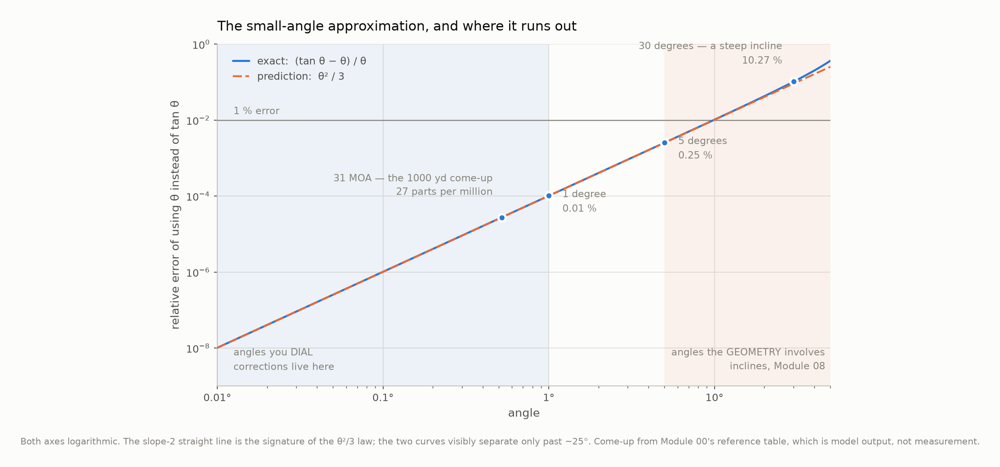
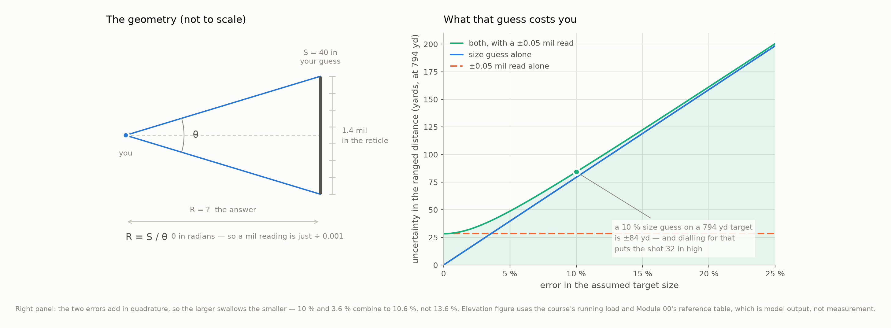
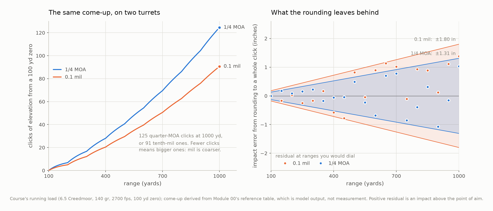

# Module 02 — Angles, Trigonometry, and Angular Measure

> By the end of this module you will know what every number on your turret and
> in your reticle is worth in inches at any range, and you will know exactly
> which of the shortcuts everyone uses are safe.

**Prerequisites:** Module 01.
**You will build:** `ballistics/angles.py` — the geometry layer, and the first
code in the course that answers a question a shooter actually asks out loud.
**Estimated time:** ~2 hours

---

## 1. Why this matters

You are looking at a steel torso plate through a mil reticle. You know steel
torsos are about 40 inches tall. The plate spans 1.4 mils. So it is at

$$R = \frac{40\ \text{in}}{1.4 \times 0.001} = 28{,}571\ \text{in} = 794\ \text{yd}$$

You dial 21.3 MOA, break the shot, and it sails over the top.

Nothing in that arithmetic was wrong. The formula is right, the division is
right, the dial is right. The problem is the **40**. You did not measure that
plate; you remembered it. If it was really a 36-inch plate — still a perfectly
ordinary size — then it was at 714 yards, not 794, and you just dialled four
minutes too much.

Here is the part that makes reticle ranging genuinely dangerous rather than
merely imprecise: **the range error is exactly proportional to the size error.**
Guess the size 10% high and you get a range 10% high, at 200 yards and at 1200.
No optic fixes it. No steadier position fixes it. A better reticle lets you read
the subtension more precisely, and the subtension was never the problem.

For the load this course carries, a 10% size guess at 794 yards is a ±84 yard
uncertainty, and dialling for the top of that band puts the shot **32 inches
high**. That is a clean miss on anything smaller than a car.

This module is the geometry that connects angles to inches. It is also where you
learn which approximations in that geometry are free — and they mostly are,
which is worth knowing precisely so you can stop worrying about the ones that
do not matter and start worrying about the one that does.

## 2. Learning objectives

By the end of this module you will be able to:

- [ ] Solve the firing-geometry right triangle with $\sin$, $\cos$, and $\tan$,
      and say which one a given problem needs.
- [ ] Derive the subtension relation $s = R\tan\theta$ and state the error in
      the $s \approx R\theta$ form, with its leading term.
- [ ] Convert among MOA, SMOA, mil, and degrees, and compute what each is worth
      in inches at any range.
- [ ] Range a target from its reticle subtension, and propagate a size guess and
      a reading error into a range uncertainty.
- [ ] Compute a correction in turret clicks and bound the error that rounding to
      a whole click leaves behind.
- [ ] Set up the geometry of an inclined shot, and say what it does *not* yet
      tell you.

## 3. Concepts

### An angle is a ratio, which is why radians disappear from equations

Wrap a piece of string around a circle of radius $R$. The angle subtended by an
arc of length $\ell$ is *defined*, in radians, as

$$\theta = \frac{\ell}{R}$$

A length divided by a length. The units cancel, and the radian is what is left
over: a name for a pure number, not a unit in the sense that a metre is. That is
why $[\theta] = [1]$ in the dimensional bookkeeping of Module 01, and why
$R\theta$ comes out in metres when $R$ is in metres.

This is also why **radians are the only angular unit you may put directly into a
formula.** Degrees, MOA, and mils all carry a hidden conversion factor. Feed
degrees to $\sin$ and you get a wrong answer with no complaint from anybody.
`ballistics.units` exists to make that mistake hard.

### Subtension turns the angle into inches on the target

A target at range $R$ that spans an angle $\theta$ in your sight covers a length

$$s = R\tan\theta$$

This is the right triangle: $R$ is the adjacent side (along your line of sight),
$s$ is the opposite side (across the target), and $\tan$ is the ratio between
them. It is worth being clear about why $\tan$ and not the arc-length $R\theta$
we just defined: **the target is flat and square-on, not curved around you.**
$R\theta$ is the length of an arc at constant range; $R\tan\theta$ is the length
of a straight line on a plane perpendicular to your line of sight. A paper
target is the second thing.

They differ by less than a part per million at any angle you will ever dial,
which is the entire subject of the next section.

### Every subtension is a straight line through the origin

Fix the angle and let the range vary. $\tan\theta$ is then a constant, so

$$s = (\tan\theta)\, R$$

is a straight line through the origin with slope $\tan\theta$. Three
consequences follow, and all three are used later in this course:

1. **Double the range, double the subtension.** One MOA is 1.047 inches at 100
   yards and 10.472 inches at 1000.
2. **The ratio of any two angular units is constant.** A mil is 3.44 times a MOA
   at every range, because both lines pass through the origin. Two angular units
   can never converge or diverge with distance. If you read a claim that two of
   them "are close out to 600 yards and then separate", the claim is false about
   geometry, not merely imprecise.
3. **An angular error is a *proportional* linear error.** This is why the
   ranging problem above scales, and why Module 25 measures group size in
   angular units in the first place.

### The three units, as geometry rather than as definitions

Module 01 established what the units *are*. Here is what they are *worth*:

| Unit | In radians | At 100 yd | At 1000 yd |
|---|---|---|---|
| 1 mil | $0.001$ | 3.600 in | 36.000 in |
| 1 MOA | $\pi/10800 = 2.90888\times10^{-4}$ | 1.047 in | 10.472 in |
| 1 SMOA (IPHY) | $1/3600 = 2.77778\times10^{-4}$ | 1.000 in | 10.000 in |
| 0.1 mil (one click) | $10^{-4}$ | 0.360 in | 3.600 in |
| 1/4 MOA (one click) | $7.27221\times10^{-5}$ | 0.262 in | 2.618 in |

Read the last two rows carefully, because they contradict something almost
everyone believes. **A tenth-mil click is bigger than a quarter-MOA click** — by
a factor of

$$\frac{10^{-4}}{\pi/43200} = \frac{4.32}{\pi} = 1.3751$$

so the mil turret is 37.5% *coarser*. Not finer. And because that ratio is a
constant, it is 37.5% coarser at 100 yards and at 1000 yards alike. Section 6
shows what the difference actually costs, which turns out to be nothing you can
shoot.

### Ranging is the same formula, solved for the other unknown

If you know $s$ and measure $\theta$, then $R = s / \tan\theta$, and for the
small angles a reticle reads this is just $R = s/\theta$ with $\theta$ in
radians. That is why the mil took over reticles: a mil is exactly a
milliradian, so

$$R = \frac{s}{\text{mils} \times 0.001} = \frac{1000\, s}{\text{mils}}$$

The range in whatever unit $s$ was measured in. No trigonometry, no conversion
table, one division. The unit was designed for this.

### An error in the size guess passes straight through

$R$ is proportional to $s$ and inversely proportional to $\theta$. For a
quantity built from a product or quotient, *relative* uncertainties combine in
quadrature (Module 01, §"How errors grow"):

$$\frac{u_R}{R} = \sqrt{\left(\frac{u_s}{s}\right)^2 + \left(\frac{u_\theta}{\theta}\right)^2}$$

Two things fall out of this that matter in the field.

**The size guess dominates, and quadrature is why.** Squaring punishes the
smaller term. A 10% size error combined with a 3.6% reading error gives 10.6%,
not 13.6% — the reading error contributes six tenths of one percent. Reading the
reticle more carefully is very nearly worthless while the size is a guess.

**Nothing about the optic improves it.** $u_s/s$ is a fact about your knowledge
of the target, not about your equipment. This is the whole argument for the
laser rangefinder, and it is a stronger argument than "it is more convenient".

### Setting up the inclined shot — and stopping there

Shoot up or down a slope at inclination $\phi_{\text{inc}}$ and there are now
two ranges: the **slant range** $R$ you actually measure along the line of
sight, and the **horizontal range** $R\cos\phi_{\text{inc}}$ underneath it. The
target is at slant range $R$ and its height above you is $R\sin\phi_{\text{inc}}$.

The reason this is not simply "use the horizontal range" is that gravity does
not care which of those two numbers you wrote down. Decompose $\vec g$ in the
tilted frame and one component acts perpendicular to the line of sight — that is
the part which curves the bullet away from where you are looking — while the
other acts along it, changing the bullet's speed and therefore its time of
flight. The familiar rule keeps the first and throws away the second.

**How wrong that is, and when, is Module 08's question, not this one.** M02 owns
the triangle; M08 owns the trajectory through it. Setting the geometry up
correctly now is what makes that module short.

## 4. The mathematics

### The subtension relation

> **Subtension.** A target at range $R$ subtending an angle $\theta$ covers a
> length
> $$s = R\tan\theta$$
> and inverting, an offset $s$ observed at range $R$ subtends
> $$\theta = \arctan\frac{s}{R}$$
> Both exact. $\theta$ in radians, $s$ and $R$ in the same length unit.

### Where the small-angle approximation comes from, and what it costs

Expand $\tan\theta$ as a Maclaurin series. From $\tan\theta = \sin\theta/\cos\theta$
with the standard series for each,

$$\sin\theta = \theta - \frac{\theta^3}{6} + \frac{\theta^5}{120} - \dots
\qquad
\cos\theta = 1 - \frac{\theta^2}{2} + \frac{\theta^4}{24} - \dots$$

Dividing (or differentiating $\tan$ repeatedly at zero, which is more tedious
and gives the same thing):

$$\tan\theta = \theta + \frac{\theta^3}{3} + \frac{2\theta^5}{15} + \dots$$

So replacing $\tan\theta$ by $\theta$ throws away $\theta^3/3$ and everything
after it. Two ways to state the damage, and they answer different questions:

$$\underbrace{\tan\theta - \theta \approx \frac{\theta^3}{3}}_{\text{absolute}}
\qquad\qquad
\underbrace{\frac{\tan\theta - \theta}{\theta} \approx \frac{\theta^2}{3}}_{\text{relative}}$$

> **The small-angle error.** Using $\theta$ in place of $\tan\theta$ understates
> the result by a *fraction* $\theta^2/3$, with $\theta$ in radians.

The relative form is the useful one, because it is independent of range. Put
numbers on it:

| $\theta$ | in radians | relative error | what that is |
|---|---|---|---|
| 31 MOA | 0.00906 | 0.0027% | the running load's 1000 yd come-up |
| $1^\circ$ | 0.01745 | 0.0102% | |
| $5^\circ$ | 0.08727 | 0.2546% | |
| $30^\circ$ | 0.52360 | 10.27% | a steep mountain shot |

**For anything you dial, the approximation is free.** At 31 MOA the error is 27
parts per million — on a 326-inch come-up, nine thousandths of an inch. For the
*geometry* of a steep shot it is not free at all, and Module 08 will use the
exact form throughout.

Turned around, the question "at what angle does this cost me one inch?" has a
range-dependent answer, because the absolute error is $R\theta^3/3$:

$$\theta_{1\ \text{in}} = \sqrt[3]{\frac{3 \times 1\ \text{in}}{R}}$$

which is $5.4^\circ$ at 100 yards, $3.2^\circ$ at 500, and $2.5^\circ$ at 1000.
Even at 1000 yards you have to be 150 MOA off the horizontal before the
shortcut costs you an inch, and 150 MOA is five times any come-up in this
course.

### Boxed result: why "1 mil is 3.6 inches at 100 yards" is exactly true

This is quoted everywhere as a rule of thumb. It is better than that — in the
linear form it is *exact*, and the reason is a coincidence of definitions rather
than anything about mils.

Start from Module 01's exact factors. The international yard is exactly
0.9144 m, so

$$100\ \text{yd} = 91.44\ \text{m} \quad\text{exactly}$$

A mil is exactly $10^{-3}$ radians, so the linear subtension is

$$s = R\theta = 91.44\ \text{m} \times 10^{-3} = 0.09144\ \text{m} = 9.144\ \text{cm}$$

And the inch is exactly 0.0254 m, so

$$s = \frac{0.09144}{0.0254} = 3.6\ \text{in} \quad\text{exactly}$$

Every step is a defined conversion; nothing was rounded. The 3.6 falls out
because $0.9144/0.0254 = 36$ — that is, there are exactly 36 inches in a yard,
which is the definition of a yard. **The "coincidence" is just the inch-yard
relationship wearing a disguise.**

The exact-tangent value is $3.6000012$ inches. The rule of thumb is short by
1.2 millionths of an inch, and it is not a rule of thumb.

> **Careful.** The same reasoning gives "1 mil = 10 cm at 100 m", also exact in
> the linear form. Neither statement survives an exact $\tan$: the honest
> version is $91.44\tan(0.001) = 0.091440030$ m. The tests in
> `tests/test_m02_angles.py` assert the tangent value and assert the size of the
> gap separately, rather than asserting an equality that is only true of the
> approximation.

### Propagating the ranging error

Let $R = s/\theta$. The standard first-order propagation (Module 26 does this
properly and in general; here it is two variables) takes partial derivatives:

$$\frac{\partial R}{\partial s} = \frac{1}{\theta} = \frac{R}{s}
\qquad
\frac{\partial R}{\partial \theta} = -\frac{s}{\theta^2} = -\frac{R}{\theta}$$

so

$$u_R^2 = \left(\frac{R}{s}\right)^2 u_s^2 + \left(\frac{R}{\theta}\right)^2 u_\theta^2$$

and dividing through by $R^2$:

> **Ranging uncertainty.**
> $$\frac{u_R}{R} = \sqrt{\left(\frac{u_s}{s}\right)^2 + \left(\frac{u_\theta}{\theta}\right)^2}$$
> The relative uncertainties add in quadrature. The sign on
> $\partial R/\partial\theta$ vanishes in the squaring, which is correct: an
> uncertainty has no direction.

### Worked example — ranging a plate, and missing it

The course's running load: 6.5 Creedmoor, 140 gr Berger Hybrid Target, 2700 fps,
100-yard zero. A steel torso plate you believe is 40 inches tall spans 1.4 mils
in your reticle. You read the reticle to about ±0.05 mil, and your memory of
"torso plates are 40 inches" is good to about ±10%.

**Step 1 — the range.**

$$s = 40\ \text{in} = 1.0160\ \text{m}, \qquad \theta = 1.4\ \text{mil} = 0.0014\ \text{rad}$$

$$R = \frac{1.0160}{0.0014} = 725.71\ \text{m} = 793.7\ \text{yd}$$

Call it 794 yards.

**Step 2 — the relative uncertainties.**

$$\frac{u_s}{s} = 0.10 \qquad\qquad \frac{u_\theta}{\theta} = \frac{0.05}{1.4} = 0.03571$$

**Step 3 — combine them.**

$$\frac{u_R}{R} = \sqrt{0.10^2 + 0.03571^2} = \sqrt{0.010000 + 0.001276} = 0.10619$$

10.62%. Note what the reading error bought: it moved 10.00% to 10.62%. The size
guess is doing 94% of the damage.

**Step 4 — in yards.**

$$u_R = 0.10619 \times 793.7 = 84.3\ \text{yd}$$

The plate is somewhere between **709 and 878 yards**, one standard uncertainty.

**Step 5 — what that costs on the target.** Suppose the truth is 794 yards but
you believe the top of the band, 878. From Module 00's reference table — *model
output, not measurement* — the come-up at 878 yards is 25.20 MOA, and at 794 it
is 21.31 MOA. You dial 25.20 and the bullet arrives at 794 yards having been
launched for 878, landing high by

$$\Delta = R\left[\tan(25.20\ \text{MOA}) - \tan(21.31\ \text{MOA})\right]
= 725.7\ \text{m} \times 1.132\times10^{-3} = 0.821\ \text{m}$$

**32.3 inches — two and three quarter feet high.** Over the top of a torso
plate with room to spare, from an arithmetic error of nothing at all. The
formula was right the whole way through. The 40 was a guess.

## 5. Building the code

`src/ballistics/angles.py` is small and does three jobs: subtension both ways,
reticle ranging with its error, and turret clicks.

### `tan` and `atan2` everywhere, on purpose

The exact and approximate forms differ by parts per million at the angles this
module cares about. The library uses the exact form anyway:

```python
def subtension_m(angle_rad: float, range_m: float) -> float:
    return range_m * math.tan(angle_rad)


def angle_for_offset_rad(offset_m: float, range_m: float) -> float:
    return math.atan2(offset_m, range_m)
```

The reason is not precision, it is *durability*. Module 07 launches projectiles
at angles where the linear form starts to lie, Module 08 tilts the whole frame
by 30 degrees, and neither module wants to audit which of its call sites
inherited a small-angle assumption from a function written two months earlier.
Being exact by construction costs one function call and removes a class of bug
that would otherwise appear later and quietly.

`atan2` rather than `atan(offset_m / range_m)` is the same argument in
miniature. The two agree everywhere except $R = 0$, where the division raises
and `atan2` returns a right angle — which is the correct answer. Module 08's
zero-finder will evaluate that endpoint, and an exception there is a bug you
only meet under a root finder.

### `mil_ranging_m` uses the linear form, and that is not an inconsistency

```python
def mil_ranging_m(target_size_m: float, mils: float) -> float:
    if mils <= 0.0:
        raise ValueError(f"mils must be positive, got {mils}")
    ...
    return target_size_m / (mils * RAD_PER_MIL)
```

Here the approximation is used deliberately, and the reason is honesty about
where the error lives. Reticle subtensions are read to about a tenth of a mil.
The tangent correction at these angles is around one part in $10^7$ — roughly
five thousand times finer than the reading. Wrapping this in `atan` would be
false precision: it would make the function look more careful while changing
nothing, and it would obscure the fact that this whole calculation is dominated
by a number the user guessed.

The `ValueError` guards matter more than they look. These are the two inputs a
shooter types under time pressure, and a negative or zero mil reading would
otherwise produce a silently absurd range rather than a traceback.

### Clicks are deliberately not rounded

```python
def clicks_for_angle(angle_rad: float, click_rad: float) -> float:
    return angle_rad / click_rad
```

A correction of 124.6 clicks is what the physics asks for; 125 is what the
turret can do. Rounding inside the function would hide the residual, and the
residual is precisely what Figure 3 is about. Rounding is the caller's decision,
and `angle_for_clicks` exists to turn the rounded count back into the angle you
really dialled so the two can be differenced.

`CLICK_RAD` names the five click sizes a scope actually ships with, so that no
figure or exercise in this course carries `0.0001` as a bare literal. It is a
`MappingProxyType` for the same reason `ICAO_SEA_LEVEL` is: a shared mutable
module-level dict is a bug waiting for a long course.

### The two imperial functions, and why they are allowed

`moa_subtension_in(range_yd)` and `smoa_subtension_in(range_yd)` take yards and
return inches, which breaks the SI-inside rule that every other function in the
library obeys. They exist to print the two numbers a shooter checks a scope
against — 1.047 and 1.000 at 100 yards — and routing them through metres at
every call site would bury the one fact they carry. Their names end in `_in`,
they are grouped under a comment that says what they are, and nothing else in
the file works this way.

## 6. Visualising it



**Figure 2.1** — The relative error of the small-angle approximation against
angle. **Both axes are logarithmic**, spanning eight decades of error across
three and a half decades of angle; on linear axes the entire useful region would
be a flat line on the floor. The dashed line is the $\theta^2/3$ prediction
derived in §4, drawn over the exact curve.

**What to notice:** the two curves are the same line until about 25 degrees. That
is the derivation confirming itself — and the straight line on log-log axes,
with slope 2, *is* the $\theta^2$ law made visible, not merely consistent with
it. Now read across the shaded regions. Everything you dial lives in the left
band, where the error is measured in parts per million. Every angle the
*geometry* involves on a steep shot lives in the right band, where by 30 degrees
the approximation is throwing away 10%. **Same approximation, same course, two
completely different verdicts** — which is why "is the small-angle approximation
OK?" is not a question with one answer, and why this figure is a plot rather
than a sentence.



**Figure 2.2** — Left: the ranging geometry, **not to scale** — the real
triangle in the worked example is 794 yards long and 40 inches tall, about
700:1, which would draw as a horizontal line. Right: how the uncertainty in the
answer grows with the uncertainty in the guess, for the worked example's
794-yard plate. The elevation consequence is annotated rather than plotted,
because drop is a different measure on a different scale and this course does
not put two scales on one axis.

**What to notice:** the blue line is straight and passes through the origin — a
10% size error is a 10% range error, always, with no range at which it gets
better. But the real lesson is the gap between the blue and green lines, which
is the quadrature at work: adding a ±0.05 mil reading error to a 10% size guess
moves the total from 10.0% to 10.6%. **The dashed orange line — the reading
error alone — is flat, because it does not depend on the size guess at all, and
it is the smaller term everywhere past a 3.6% size error.** Squinting harder through the
scope is very nearly worthless while the target's size is a memory. That is the
argument for a laser rangefinder, and it is a physics argument rather than a
convenience one.



**Figure 2.3** — Left: the running load's come-up expressed as a click count on
a quarter-MOA turret and on a tenth-mil turret. Right: what is left over after
rounding to the nearest whole click. The shaded bands are the half-click
envelope the residual can never leave; the dots are the actual residual at
ranges you would really dial. Come-up is derived from Module 00's reference
table, which is model output, not measurement.

**What to notice:** the mil turret needs *fewer* clicks — 91 against 125 at 1000
yards — and that is the same fact as its clicks being **bigger**. The tenth-mil
band on the right is the wider of the two, by the constant factor 1.375 derived
in §3. So the common belief that mil turrets are the finer instrument is exactly
backwards.

And then notice that it does not matter. The worst the rounding can ever cost is
half a click: **1.31 inches on the quarter-MOA turret at 1000 yards, 1.80 inches
on the tenth-mil.** Both are comfortably inside the group the rifle will shoot at
that distance, and both are two orders of magnitude below the 32-inch miss that
Figure 2.2's size guess produced. Choose your turret for whether you think in
mils or minutes, because the resolution argument is noise.

## 7. Limits and sanity checks

**Degenerate cases, and what the code does with them.**

| Case | Result | Why |
|---|---|---|
| $R = 0$ | `angle_for_offset_rad` returns $\pi/2$ | An offset at zero range subtends a right angle. `atan2` gets this right; division does not. |
| $\theta \to 90^\circ$ | `subtension_m` blows up | Correct — a line of sight parallel to the target plane never meets it. |
| $\theta = 0$ | $s = 0$ | |
| mils $\le 0$ | `ValueError` | A non-positive reticle reading is user error, and a silently negative range is worse than a traceback. |

**Sanity checks you can run in your head.** One MOA is *about* an inch at 100
yards and about 10 at 1000. One mil is 3.6 inches at 100 yards and 36 at 1000.
If a solver tells you to dial something that does not scale linearly with range
in those terms, something upstream is wrong.

**What this module cannot do.**

- **There is no bullet in it.** Everything here is pure geometry: static
  triangles, no time, no gravity, no air. It tells you what an angle is worth,
  never what angle to use. That arrives in M07 and M08.
- **It cannot tell you the inclined-shot answer.** §3 sets the triangle up and
  stops. The reason the naive rule fails is a statement about the trajectory
  through that triangle, and it needs a solver.
- **It assumes the target is perpendicular to your line of sight.** A plate
  angled away subtends less than its true size, which reads as extra range. On
  a steep shot this and the incline geometry interact.
- **It says nothing about whether you can *read* the subtension.** The ±0.05 mil
  figure in the worked example is an assumption, not a measurement. Module 24
  sources instrument uncertainties properly; do not treat that number as
  authoritative before then.

## 8. Field takeaways

- **Your reticle-ranged distance is only as good as your size guess, and the
  relationship is one-to-one.** A 10% size error is a 10% range error at every
  distance. Reading the reticle more carefully does almost nothing while the
  size is remembered rather than measured.
- **A 40-inch guess that should have been 36 will miss a torso plate at 800
  yards by nearly three feet.** If you must reticle-range, range something whose
  size you *know*, and treat the answer as a bracket rather than a number.
- **Mil turrets are coarser than quarter-MOA turrets, by 37.5%.** If you have
  been choosing between them on resolution, you have been choosing on a myth.
  Pick the one that matches how you think and how your spotter calls, because
  the worst either costs you is under two inches at 1000 yards.
- **MOA and SMOA are different units and the difference is dialable.** A 1000
  yard come-up of 31.2 MOA is 32.6 SMOA; dial the second number on a true-MOA
  turret and you are 15 inches high.
- **Stop worrying about $\tan$ versus $\theta$ for anything you dial.** At 31
  MOA the difference is nine thousandths of an inch on a 326-inch come-up. Spend
  the attention on the range estimate instead, where the errors are four orders
  of magnitude larger.

## 9. Exercises

Seven problems in [`exercises/exercises.md`](exercises/exercises.md), with
complete worked answers in [`exercises/solutions.md`](exercises/solutions.md):
click arithmetic on a real dial, a mil-ranging problem with error bars, the
range at which the small-angle approximation costs an inch, MOA against SMOA on
a 1000-yard correction, a library extension, reading Figure 2.1, and a
diagnosis with four candidates and one question to ask.

## 10. Key equations

| Quantity | Equation | Notes |
|---|---|---|
| Subtension | $s = R\tan\theta$ | exact; $\theta$ in radians |
| Angle from an offset | $\theta = \arctan(s/R)$ | use `atan2` |
| Small-angle form | $s \approx R\theta$ | relative error $\theta^2/3$ |
| Absolute error of that form | $R\theta^3/3$ | one inch at $5.4^\circ$ / 100 yd |
| Mil ranging | $R = s/(\text{mils}\times 10^{-3})$ | $s$ and $R$ in the same unit |
| Ranging uncertainty | $\dfrac{u_R}{R} = \sqrt{\left(\dfrac{u_s}{s}\right)^2 + \left(\dfrac{u_\theta}{\theta}\right)^2}$ | relative, in quadrature |
| Clicks | $n = \theta / \theta_{\text{click}}$ | round; residual $\le \theta_{\text{click}}/2$ |
| MOA / SMOA | $\pi/3 = 1.04720$ | exactly, as angles |
| 0.1 mil / 0.25 MOA | $4.32/\pi = 1.3751$ | exactly; the mil click is coarser |
| Slant vs horizontal range | $R_{\text{horiz}} = R\cos\phi_{\text{inc}}$ | geometry only — see M08 |

**Worth memorising:** 1 mil = 3.6 in at 100 yd (exactly). 1 MOA = 1.047 in at
100 yd. 1 SMOA = 1.000 in at 100 yd, by definition.

## 11. References

- Angular units, the exact MOA/SMOA ratio, and the conversion factors: Module 01
  of this course, and [`docs/units-and-conventions.md`](../../docs/units-and-conventions.md) §5 and §7.
- Reticle ranging and mil-based reticles in practice: Litz, *Applied Ballistics
  for Long-Range Shooting*, and the US Army sniper field manuals — see
  [`docs/references.md`](../../docs/references.md).
- Series expansions of the trigonometric functions: any calculus text; the
  expansions used here are standard and are derived in §4 rather than cited.
- The come-up figures in §4 and Figures 2.2 and 2.3 come from
  `modules/00-orientation/data/effect_magnitudes.csv`, which is **model output,
  not measurement**, produced by the standalone reference implementation shipped
  with Module 00.

## 12. What's next

You can now turn an angle into a distance on a target and back. What you cannot
yet do is describe a *direction* — and almost everything from here on is
directional. Wind comes from somewhere, spin drift goes one way and not the
other, and the bullet's velocity has three components that change independently.

**Module 03** builds vectors and the coordinate frames this course computes in:
adding and decomposing velocities, the dot and cross products and what each
means physically, and the frame conventions that fix once and for all what
"positive" means for up, right, and downrange. It is also where the wind
direction convention gets nailed down, which is the single most abused sign in
exterior ballistics.
